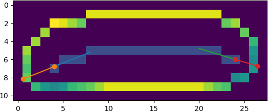
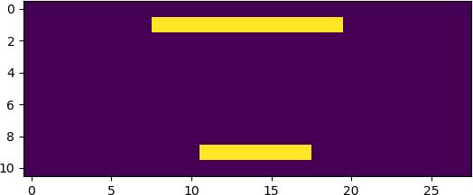

This is a pair of scripts for measuring bacterial cell width and
length from phase contrast images, which should work for curved and
filamentous cells. It is semi-automated and allows for manual
inspection and correction/rejection of incorrect results. There are
two parts:

### An ImageJ macro (`Measure.java`)

This requires [Fiji](https://fiji.sc/).

The easiest way to run it is by dragging `Measure.java` onto the main
Fiji window and pressing 'Run'. Select a folder containing input files
(`.tif` format). Any images for which output files already exist will
be skipped. Cells are identified using 'Threshold', and 'Analyze
Particles'. You may need to adjust the parameters in the macro for
this to work well. After this stage, the macro pauses to allow you to
correct or remove any cells that were incorrectly detected. The cells' 
pixels are then output to text files for further analysis.

### A Python script (`process.py`)

This requires Python 3.

This script processes the files created by the ImageJ macro. First,
the skeleton is found using `skimage.morphology.skeletonize`. This
skeleton is analysed using [skan](https://jni.github.io/skan/) to
determine its length and the number of branches.  Branched skeletons
are not processed. We then extend the skeleton to the end of the cell,
to determine its length.

To find the cell width, we calculate the distance of the cell's
perimeter from the skeleton using `mahotas.distance`. To exclude the
end caps, we remove all pixels within a defined radius from the ends
of the skeleton. You can customise this by changing
`MASK_RADIUS`. This gives us just the outline of the mid part of the
cell.

Since the pixel values are equal to their distance from the skeleton,
we can take their mean and multiply it by 2 to get the mean width of
the middle part of the cell.

The script provides a simple interface to allow you to vet the final
results in your web browser. You can press 'y' or 'n' to determine
which values make it to the final results table.
